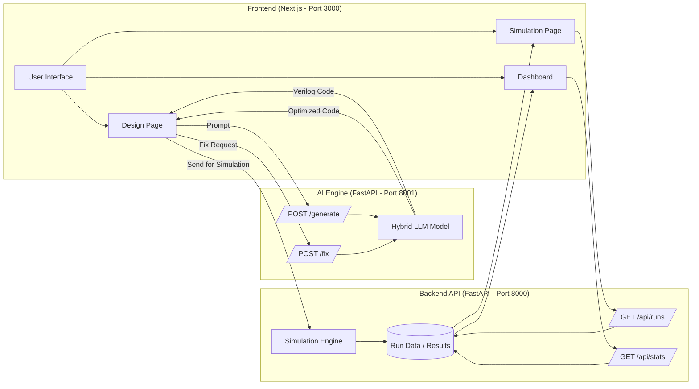

# 🚀 QANTYX – AI-Powered VLSI Design & Simulation Platform

QANTYX is an end-to-end AI-powered VLSI design platform that enables users to generate, optimize, and simulate Verilog designs using advanced language models and modern web technologies.

It combines **AI-based code generation**, **design correction**, **simulation workflows**, and **analytics dashboards** into one unified system.

---

## 🌟 Features

### 🧠 AI Verilog Generation
- Generate synthesizable Verilog code from natural language prompts
- Supports modules like ALU, counters, FSMs, and more
- Uses hybrid LLM architecture for better accuracy

### 🔧 Code Optimization & Fixing
- Automatically fixes syntax errors
- Improves synthesizability
- Enhances code quality

### ⚡ Simulation System
- Run simulations on generated Verilog designs
- Analyze performance metrics
- Supports iterative testing

### 📊 Dashboard & Analytics
- View simulation runs
- Track system statistics
- Monitor performance

### 🌐 Full Stack Integration
- Frontend + Backend + AI Engine fully connected
- REST API-based communication
- Real-time interaction

---

## 🏗️ Architecture Overview

- Frontend handles UI and user interaction
- AI Engine generates and fixes Verilog code
- Backend manages simulation and analytics
- All components communicate via APIs



---
## 🔌 Ports & Services

| Service           | URL                        | Description |
|------------------|---------------------------|------------|
| Frontend         | http://localhost:3000     | User Interface |
| AI Engine        | http://127.0.0.1:8001     | Verilog generation & fixing |
| Backend API      | http://127.0.0.1:8000     | Simulation & analytics |
| AI Docs          | http://127.0.0.1:8001/docs| Swagger for AI engine |
| Backend Docs     | http://127.0.0.1:8000/docs| Swagger for backend |

---

## 🔌 API Endpoints

### **AI Engine (Port 8001)**

- **Fix Verilog**
  - **POST** `/fix`
  - **Request**
    ```json
    { "verilog": "module ..." }
    ```
  - **Response**
    ```json
    { "optimized": "module ..." }
    ```

- **Health Check**
  - **GET** `/health`

---

### **Backend API (Port 8000)**

- **Get Runs**
  - **GET** `/api/runs/`

- **Get Stats**
  - **GET** `/api/stats`

---

## ⚙️ Setup Instructions

### Setup Python Environment

``` bash
python -m venv venv
venv\Scripts\activate  # Windows
pip install -r requirements.txt
```

### Run AI Engine

``` bash
cd ai_engine
python -m uvicorn main:app --port 8001 --reload
```

### Run Backend

``` bash
cd backend
python -m uvicorn main:app --port 8000 --reload
```

### Run Frontend

``` bash
cd frontend
npm install
npm run dev
```

------------------------------------------------------------------------

## 🔄 Workflow

1.  User enters prompt in frontend\
2.  Request sent to AI Engine via `/generate`\
3.  Verilog code generated\
4.  Optional fixing via `/fix`\
5.  Backend runs simulation\
6.  Results shown in dashboard

------------------------------------------------------------------------

## 🧪 Example Use Cases

-   Generate digital circuits (ALU, counters)\
-   Fix broken Verilog code\
-   Run simulations\
-   Analyze design performance

------------------------------------------------------------------------

## 🛠️ Tech Stack

  Layer           Technology
  --------------- -----------------
  Frontend        React / Next.js
  Backend         FastAPI
  AI Engine       Python + LLM
  Communication   REST APIs

------------------------------------------------------------------------

## 🚧 Limitations

-   Local simulation depends on system performance\
-   Requires manual setup\
-   Limited dataset for optimization tuning

------------------------------------------------------------------------

## 🔮 Future Enhancements

-   Cloud-based simulation\
-   FPGA integration\
-   Advanced visualization\
-   Multi-user collaboration\
-   AI-based performance prediction

------------------------------------------------------------------------

## 🤝 Contributing

Pull requests are welcome!\
For major changes, please open an issue first.

------------------------------------------------------------------------

## 📜 License

MIT License

------------------------------------------------------------------------

## 💡 Notes

-   Ensure all services run on their correct ports\
-   Enable CORS for frontend-backend communication\
-   Use Swagger Docs to test APIs
